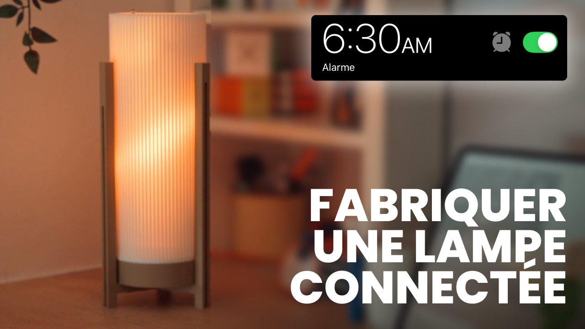
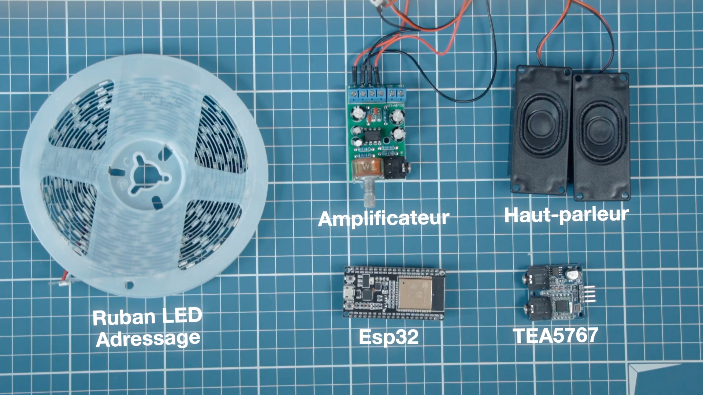

# 🛋️ Tuto faire une lampe connectée 
Petit dossier pour vous montrer comment faire une lampe connectée.
La lampe a les fonctionnalités suivantes : 
- **Réveil simulateur d'aube** : La lampe monte en luminosité progressive pour te réveiller en douceur en 30 min en fonction de l'heure de ton réveil
- **Radio intégrée** : La lampe intègre une radio pour te permettre d'écouter de la musique ou les informations
- **Contrôle via une application** : La lampe est connectée à une application mobile pour te permettre de contrôler à distance la couleur de cette dernière, la fréquence radio ou encore l'heure des réveils.

##  ⚙️ Matériel 
Pour le matériel, il te faudra les composants suivants. Si tu ne veux pas de module radio tu peux prendre uniquement l'ESP32 et le ruban de LED.

| Composant                                                                                                                                                                                                                                                                                                                                                                                                                                                                                                                                                                                                                         | Prix    |
|-----------------------------------------------------------------------------------------------------------------------------------------------------------------------------------------------------------------------------------------------------------------------------------------------------------------------------------------------------------------------------------------------------------------------------------------------------------------------------------------------------------------------------------------------------------------------------------------------------------------------------------|---------|
| [ESP32](https://www.amazon.fr/AZDelivery-Development-successeur-Compatible-incluant/dp/B071P98VTG/ref=sr_1_6_pp?__mk_fr_FR=%C3%85M%C3%85%C5%BD%C3%95%C3%91&crid=38MJNHEFQ1LEM&dib=eyJ2IjoiMSJ9.sPPlRZhDzA51UnKqFSiK3kmRCRwz9det9X7AR4urj1n1LKgksbNG9-kTlt73TG0Sop7TYQ-gMmxdPpH2fyw9gNr3KfCaG2yOfJRESj2p26tX8LulXg5CTW9KVj7PxKtl8RDevoR9VrvuoJ8lDn0Yw_aepFbrwYP06rInumsYrJwKfgSVmOUYfpHHBDSb66LrR_d-YUr4sfiT57c87kHIHC95ybLdPyGKU162xCIhRcKe20dCWyoDDVUVc8OWZJxACwq3P_9NT5FkdrjXSHwN1kwCfNsGwwNmDaW0nbzDjRg.6ZupxI-lITb9vpOjpyAKX2lHSJEJLBoJiaJNxtGwWRg&dib_tag=se&keywords=esp32&qid=1749721244&sprefix=esp32,aps,90&sr=8-6&th=1) | 10.19 € |
| [Module radio TEA5767](https://www.amazon.fr/ICQUANZX-TEA5767-antenne-t%C3%A9lescopique-76-108MHZ/dp/B07VBVDNLL?pd_rd_w=BB8O5&content-id=amzn1.sym.386ac333-999e-447a-a7eb-55ac471531ff&pf_rd_p=386ac333-999e-447a-a7eb-55ac471531ff&pf_rd_r=DZBV0TM29GQE3DR2GKXE&pd_rd_wg=tjrvZ&pd_rd_r=a3101acc-a567-4b76-9b72-91b3826d0bc1&pd_rd_i=B07VBVDNLL&psc=1&ref_=pd_bap_d_grid_rp_0_19_t)                                                                                                                                                                                                                                              | 9,99 €  |                                                                                                                                                                                                                                                                                                                                                                                                                                                                                                                                                                                                                       |
| [Amplificateur Audio TDA2822M](https://www.amazon.fr/DC1-8-12V-dAmplificateur-Puissance-Ordinateur-Haut-parleur/dp/B07LG35G22?pd_rd_w=pachc&content-id=amzn1.sym.3ae0dee9-954a-410e-befb-c6f829596b2f&pf_rd_p=3ae0dee9-954a-410e-befb-c6f829596b2f&pf_rd_r=1508NNFQFKQVV0T3DB29&pd_rd_wg=4jV0L&pd_rd_r=4b1816ec-aa99-4c0a-b192-be5f5a81e2fc&psc=1&ref_=pd_bap_d_grid_rp_csi_vtp_0_t)                                                                                                                                                                                                                                                            | 5 €     |                                                                                                                                                                                                                                                                                                                                                                                                                                                                                                                                                                                                                          |
| [Haut parleur](https://www.amazon.fr/CQRobot-Electronics-JST-PH2-0-Interface-Electronic/dp/B0738NLFTG?pd_rd_w=BB8O5&content-id=amzn1.sym.386ac333-999e-447a-a7eb-55ac471531ff&pf_rd_p=386ac333-999e-447a-a7eb-55ac471531ff&pf_rd_r=DZBV0TM29GQE3DR2GKXE&pd_rd_wg=tjrvZ&pd_rd_r=a3101acc-a567-4b76-9b72-91b3826d0bc1&pd_rd_i=B0738NLFTG&ref_=pd_bap_d_grid_rp_0_14_t&th=1)                                                                                                                                                                                                                                                         | 7,99 €  |                                                                                                                                                                                                                                                                                                                                                                                                                                                                                                                                                                                                                          |
| [LED adressables](https://www.amazon.fr/Yeexppz-Dimmable-Individually-Addressable-Intelligent/dp/B0C5R5HMK6/ref=rvi_d_sccl_44/257-0243988-0934828?pd_rd_w=GaR34&content-id=amzn1.sym.bb5542a0-fbb2-443a-898f-780bdeb13fa3&pf_rd_p=bb5542a0-fbb2-443a-898f-780bdeb13fa3&pf_rd_r=5RH5JRCB676PN9MJR131&pd_rd_wg=7jVUE&pd_rd_r=a782716e-cffb-49fb-8074-e5c14c269a00&pd_rd_i=B0C5R5HMK6&th=1)                                                                                                                                                                                                                                          | 20.29 € |                                                                                                                                                                                                                                                                                                                                                                                                                                                                                                                                                                                                                                  |                                                                                                                                                                                                                                                                                                                                                                                                                                                                                                                                                                                                |                                                                                                                                                                                                                                                                                                                                                                                                                                                                                                                                                                                                                              |
| [Câble jack jack](https://www.amazon.fr/dp/B07KTYS6FB?ref=ppx_yo2ov_dt_b_fed_asin_title)                                                                                                                                                                                                                                                                                                                                                                                                                                                                                                                                          | 2,35 €  |                                                                                                                                                                                                                                                                                                                                                                                                                                                                                                                                                                                                                                  |

## 🛒 Branchements
Branchements entre le module radio et L'ESP32

| ESP32 | Module Radio TEA5767 | 
| --- |----------------------|
| 5V | 5V                   | 
| GPIO21 | SDA                  |
| GPIO22 | SCL                  | 
| GND | GND                  |

Ensuite brancher le module Radio TEA5767 avec l'amplificateur Audio TDA2822M grâce au cable jack-jack. Puis brancher l'amplificateur aux deux enceintes et l'alimenter en 5V.  

Branchement entre le ruban de LED et l'ESP32 : 

| ESP32 | Ruban de LED | 
| --- |--------------|
| 5V | 5V           | 
| GPIO2 | DIN          |
| GND | GND          |

## 🚧 Code ESP32
### Récupérer l'adresse IP locale de l'ESP32
Dans un premier temps, on va récupérer l'adresse IP locale de l'ESP32. Pour cela lance le script [IP local](ESP32/IPlocal/IPlocal.ino) dans le dossier ESP32.  
Ouvrez le `Serial Monitor` pour récupérer l'adresse IP locale de l'ESP32.

### Code final de l'ESP32

Ensuite téléverser le [script final](ESP32/scriptESP32/scriptESP32.ino) dans l'ESP32 qui se situe dans le dossier `script ESP32`.

## 🔮 Application
Il vous faudra les prérequis suivant pour installer l'application. 
- Node.js et npm/yarn.
- Expo CLI installé.

1. Va dans le [dossier ici](Application/):
2. Installe les dépendances : `npm install`
3. Lance l'application : `npx expo start`

## Assemblage

## Conclusion
